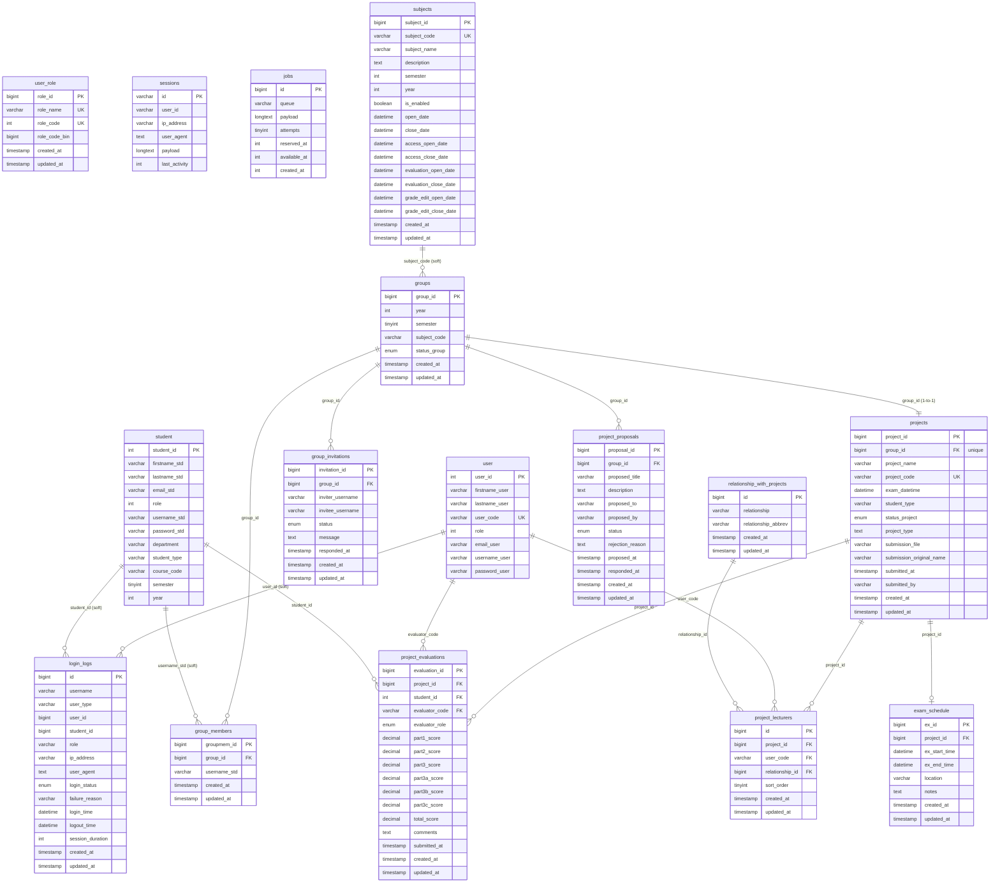

# ER Diagram — CSTU Space

> **สถานะ:** Final schema หลัง refactor ทั้งหมด (2026-05-08)
> ทุก table ใน diagram นี้ตรงกับ migration และ Model ปัจจุบัน 100%

---

## Mermaid ER Diagram



---

## คำอธิบายแต่ละ Table

### กลุ่ม: Users & Auth

#### `user`
ตารางผู้ใช้งานฝั่ง Staff (Admin, Coordinator, Lecturer, Staff) ทุกคนในระบบที่ไม่ใช่นักศึกษา
- **`user_code`** — รหัสย่อของอาจารย์/เจ้าหน้าที่ เช่น `kdc`, `ppr` ใช้เป็น FK ในหลาย table
- **`role`** — เก็บเป็น bitmask integer ตาม `user_role.role_code` ทำให้ผู้ใช้คนหนึ่งมีได้หลาย role พร้อมกัน เช่น Coordinator+Lecturer = 24576
- ไม่มี `timestamps` (สร้าง user ผ่าน seeder / import เท่านั้น)

#### `student`
ตารางนักศึกษา ใช้ guard แยกจาก `user` (`auth:student`)
- **`course_code`** — รหัสวิชาที่ลง เช่น `CS303`, `CS403` เชื่อมกับ `subjects` แบบ soft (ไม่มี FK)
- **`student_type`** — `r` = ภาคปกติ, `s` = ภาคพิเศษ, `rs` = ผสม
- **`semester`, `year`** — ภาคเรียนและปีการศึกษา (พ.ศ.) ที่นักศึกษาลงทะเบียน

#### `user_role`
ตาราง reference รายชื่อ Role ทั้งหมดในระบบ ใช้เป็น lookup เท่านั้น ไม่มี FK จาก `user`
| role_name | role_code | หมายเหตุ |
|---|---|---|
| Admin | 32768 | สิทธิ์สูงสุด |
| Coordinator | 16384 | จัดการกลุ่ม/ตาราง |
| Lecturer | 8192 | อาจารย์ที่ปรึกษา/กรรมการ |
| Staff | 4096 | ดูข้อมูล/แก้ไขบางส่วน |
| Student | 2048 | นักศึกษา (อยู่ใน `student` table) |

#### `login_logs`
บันทึก login/logout ทุกครั้งของทั้ง `user` และ `student` ไม่มี FK constraint (เก็บเพื่อ audit trail)
- **`user_type`** — `'user'` หรือ `'student'`
- **`login_status`** — `success` / `failed`

#### `sessions`
Laravel session store แบบ database สำหรับ keep-alive login state
- **`user_id`** — เป็น string (รองรับทั้ง user_id และ student_id) ไม่มี FK

#### `jobs`
Laravel Queue jobs table สำหรับ background task processing

---

### กลุ่ม: Subjects

#### `subjects`
วิชาที่เปิดในแต่ละภาคเรียน ทำหน้าที่เป็น **access controller** แทน global system open/close เดิม
- **`is_enabled`** — เปิด/ปิดวิชา (ปิด = ไม่ให้นักศึกษาเข้าระบบ)
- มี 4 ช่วงเวลาอิสระต่อกัน:
  | ช่วง | ความหมาย |
  |---|---|
  | `open_date` – `close_date` | ช่วงอายุของวิชาโดยรวม |
  | `access_open_date` – `access_close_date` | ช่วงที่นักศึกษาเข้าใช้งานได้ (middleware `CheckSubjectAccess`) |
  | `evaluation_open_date` – `evaluation_close_date` | ช่วงที่อาจารย์ส่งคะแนนได้ |
  | `grade_edit_open_date` – `grade_edit_close_date` | ช่วงที่อาจารย์แก้ไขคะแนนที่ส่งไปแล้วได้ |
- เชื่อมกับ `groups` และ `student` ผ่าน `subject_code` แบบ soft (ไม่มี FK เพื่อความยืดหยุ่น)

---

### กลุ่ม: Groups

#### `groups`
กลุ่มนักศึกษาในแต่ละภาคเรียน เป็น root entity ของ workflow ทั้งหมด
- **`status_group`** — วงจรชีวิตของกลุ่ม: `created` → `pending` → `approved` / `rejected`
- **`subject_code`** — อ้างอิง `subjects.subject_code` (soft)
- กลุ่มหนึ่งมีได้ 1 project เท่านั้น (one-to-one กับ `projects`)

#### `group_members`
pivot ระหว่าง `groups` และ `student` ผ่าน `username_std`
- unique constraint บน `(group_id, username_std)` — นักศึกษา 1 คน อยู่ได้ 1 กลุ่มในแต่ละรายวิชา
- เชื่อมกับ `student` แบบ soft (ผ่าน `username_std`) เพื่อ flexibility

#### `group_invitations`
ระบบเชิญนักศึกษาเข้ากลุ่ม
- **`status`** — `pending` / `accepted` / `declined`
- unique constraint บน `(group_id, invitee_username)` — เชิญซ้ำไม่ได้

---

### กลุ่ม: Projects

#### `projects`
โครงงานของแต่ละกลุ่ม สร้างขึ้นเมื่อ Coordinator อนุมัติกลุ่ม
- **`group_id`** — unique FK (กลุ่ม → project เป็น 1:1 เสมอ)
- **`project_code`** — รหัสโครงงานรูปแบบ `68-1-01_kdc-r1` (ปี-เทอม-กลุ่ม_advisor-ประเภทจำนวนสมาชิก)
- **`status_project`** — `not_proposed` → `in_progress` → `submitted` / `late_submission`
- **`student_type`** — `r` / `s` / `rs` ตามประเภทนักศึกษาในกลุ่ม
- **`submission_file`** — path ของ PDF รายงานที่ส่ง
- ไม่มีคอลัมน์ advisor/committee อีกต่อไป → ย้ายไปอยู่ใน `project_lecturers` แทน

#### `project_proposals`
ข้อเสนอหัวข้อโครงงานที่นักศึกษาส่งหาอาจารย์
- **`proposed_to`** — `username_user` ของอาจารย์ที่รับข้อเสนอ
- **`proposed_by`** — `username_std` ของหัวหน้ากลุ่มที่ส่ง
- **`status`** — `pending` / `approved` / `rejected`
- กลุ่มหนึ่งส่งได้หลายข้อเสนอ (ส่งหาอาจารย์หลายคน หรือส่งซ้ำหลังถูก reject)

#### `relationship_with_projects`
ตาราง reference บทบาทของอาจารย์ในโครงงาน
| id | relationship | abbrev |
|---|---|---|
| 1 | Advisor | Adv |
| 2 | Committee | Com |
| 3 | Co-Advisor-Internal | Co-Adv-Int |
| 4 | Co-Advisor-External | Co-Adv-Ext |

#### `project_lecturers`
**Pivot table หลัก** เชื่อม `projects` ↔ `user` พร้อมบทบาท แทน column เดิม `advisor_code`, `committee1_code`, `committee2_code`, `committee3_code` ที่ถูกลบออกแล้ว
- **`relationship_id`** — FK → `relationship_with_projects` ระบุบทบาท
- **`sort_order`** — ลำดับของกรรมการ (committee 1, 2, 3 ใช้ sort_order = 1, 2, 3)
- unique constraint บน `(project_id, user_code, relationship_id)` — อาจารย์คนเดียวรับได้หลายบทบาทในโครงงานเดียวกัน (เช่น advisor + co-advisor) แต่ซ้ำบทบาทเดิมไม่ได้
- Backward-compat accessors บน `Project` model ทำให้ `$project->advisor_code`, `$project->committee1` ฯลฯ ยังใช้ได้โดยไม่ต้องแก้ View

#### `project_evaluations`
คะแนนที่อาจารย์ให้แก่นักศึกษาแต่ละคนในโครงงาน
- **`evaluator_role`** — `advisor` / `committee1` / `committee2` / `committee3`
- คะแนนแบ่ง 3 ส่วน:
  | คอลัมน์ | คะแนนเต็ม | ผู้ให้ |
  |---|---|---|
  | `part1_score` | 10 | advisor เท่านั้น |
  | `part2_score` | 30 | ทุกคน |
  | `part3a/b/c_score` | 20×3 = 60 | ทุกคน |
- unique constraint บน `(project_id, student_id, evaluator_code, evaluator_role)` — อาจารย์ 1 คน ให้คะแนนนักศึกษา 1 คนใน 1 บทบาทได้ 1 ครั้ง

#### `exam_schedule`
ตารางสอบโครงงาน (1 project มีได้ 1 รายการ)
- **`ex_start_time` / `ex_end_time`** — วันเวลาเริ่ม/สิ้นสุดการสอบ
- ข้อมูลนี้ sync กับ `projects.exam_datetime` ด้วย (เก็บซ้ำเพื่อ query ง่าย)

---

## Workflow Overview

```
subjects ──── กำหนดช่วงเวลาเปิด/ปิด ────────────────────────────────┐
                                                                      │
student ──── สร้างกลุ่ม ──► groups                                    │ CheckSubjectAccess
                               │                                      │ middleware
                               ├──► group_members                     │
                               ├──► group_invitations                 │
                               │                                      │
                               ├──► project_proposals ──► (อาจารย์อนุมัติ)
                               │                                      │
                               └──► projects ◄── Coordinator อนุมัติกลุ่ม
                                       │
                          ┌────────────┼────────────┐
                          │            │            │
                   project_lecturers  exam_schedule  project_evaluations
                   (advisor/committee) (ตารางสอบ)   (คะแนนแต่ละคน)
                          │
                   relationship_with_projects
                   (บทบาท: advisor, committee, co-advisor)
```
