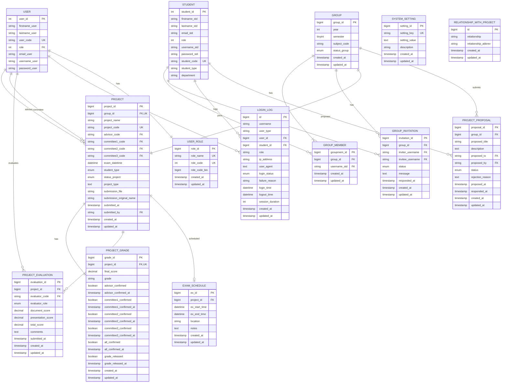

# ER Diagram - CSTU SPACE System

## Entity Relationship Diagram

## ความสัมพันธ์ระหว่างตาราง (Relationships)

### 1. USER & PROJECT
- **One-to-Many**: USER → PROJECT (advisor)
- **One-to-Many**: USER → PROJECT (committee1, committee2, committee3)
- อาจารย์ 1 คนสามารถเป็นที่ปรึกษาหรือกรรมการได้หลายโครงงาน

### 2. USER & PROJECT_EVALUATION
- **One-to-Many**: USER → PROJECT_EVALUATION
- อาจารย์ 1 คนสามารถประเมินได้หลายโครงงาน

### 3. USER & USER_ROLE
- **Many-to-One**: USER → USER_ROLE
- ผู้ใช้มีบทบาทตาม role_code

### 4. STUDENT & GROUP_MEMBER
- **One-to-Many**: STUDENT → GROUP_MEMBER
- นักศึกษา 1 คนสามารถเป็นสมาชิกกลุ่มได้หลายกลุ่ม (ในภาคการศึกษาต่างกัน)

### 5. STUDENT & GROUP_INVITATION
- **One-to-Many**: STUDENT → GROUP_INVITATION (inviter)
- **One-to-Many**: STUDENT → GROUP_INVITATION (invitee)
- นักศึกษาสามารถเชิญและถูกเชิญได้หลายครั้ง

### 6. GROUP & GROUP_MEMBER
- **One-to-Many**: GROUP → GROUP_MEMBER
- กลุ่ม 1 กลุ่มมีสมาชิกได้หลายคน

### 7. GROUP & PROJECT
- **One-to-One**: GROUP → PROJECT
- กลุ่ม 1 กลุ่มมีโครงงานได้ 1 โครงงาน

### 8. GROUP & PROJECT_PROPOSAL
- **One-to-Many**: GROUP → PROJECT_PROPOSAL
- กลุ่มสามารถส่งข้อเสนอโครงงานได้หลายครั้ง

### 9. PROJECT & PROJECT_GRADE
- **One-to-One**: PROJECT → PROJECT_GRADE
- โครงงาน 1 โครงมีเกรดได้ 1 เกรด

### 10. PROJECT & PROJECT_EVALUATION
- **One-to-Many**: PROJECT → PROJECT_EVALUATION
- โครงงาน 1 โครงถูกประเมินโดยหลายคน (ที่ปรึกษา + กรรมการ)

### 11. PROJECT & EXAM_SCHEDULE
- **One-to-Zero-or-One**: PROJECT → EXAM_SCHEDULE
- โครงงานอาจมีหรือไม่มีตารางสอบ

### 12. USER & LOGIN_LOG / STUDENT & LOGIN_LOG
- **One-to-Many**: USER → LOGIN_LOG
- **One-to-Many**: STUDENT → LOGIN_LOG
- เก็บประวัติการเข้าใช้งานของทุกคน

## สรุปโครงสร้างระบบ

ระบบนี้ประกอบด้วย **13 ตารางหลัก**:

1. **USER** - ข้อมูลผู้ใช้ (อาจารย์, ผู้ดูแลระบบ, เจ้าหน้าที่)
2. **USER_ROLE** - บทบาทของผู้ใช้
3. **STUDENT** - ข้อมูลนักศึกษา
4. **GROUP** - กลุ่มนักศึกษา
5. **GROUP_MEMBER** - สมาชิกในกลุ่ม
6. **GROUP_INVITATION** - คำเชิญเข้ากลุ่ม
7. **PROJECT** - โครงงาน
8. **PROJECT_PROPOSAL** - ข้อเสนอโครงงาน
9. **PROJECT_EVALUATION** - การประเมินโครงงาน
10. **PROJECT_GRADE** - เกรดโครงงาน
11. **EXAM_SCHEDULE** - ตารางสอบ
12. **LOGIN_LOG** - ประวัติการเข้าใช้งาน
13. **SYSTEM_SETTING** - การตั้งค่าระบบ
14. **RELATIONSHIP_WITH_PROJECT** - ความสัมพันธ์กับโครงงาน

## Flow การทำงานหลัก

1. **นักศึกษาสร้างกลุ่ม** → GROUP
2. **เชิญสมาชิก** → GROUP_INVITATION → GROUP_MEMBER
3. **เสนอโครงงาน** → PROJECT_PROPOSAL (ส่งให้อาจารย์)
4. **อนุมัติ → สร้างโครงงาน** → PROJECT
5. **กำหนดวันสอบ** → EXAM_SCHEDULE
6. **ส่งรายงาน** → อัพเดต PROJECT (submission_file)
7. **อาจารย์ประเมิน** → PROJECT_EVALUATION
8. **คำนวณเกรด** → PROJECT_GRADE
9. **อาจารย์ยืนยันเกรด** → อัพเดต PROJECT_GRADE
10. **ปล่อยเกรด** → นักศึกษาดูได้
